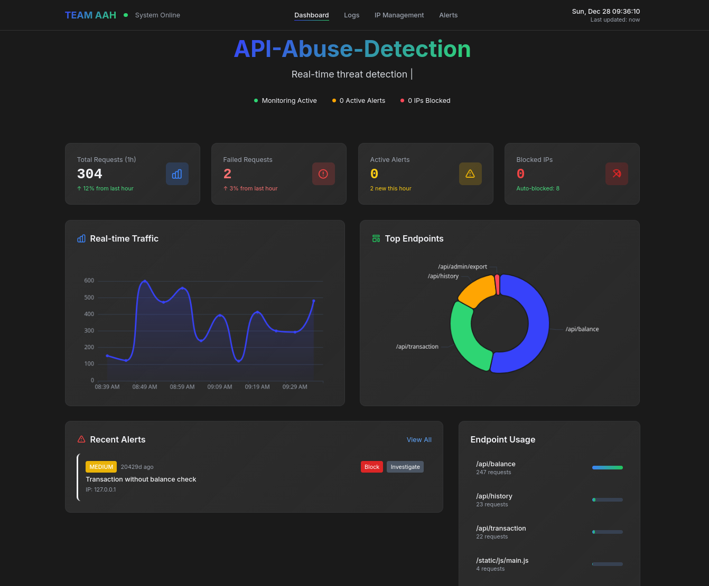

# API Abuse Detection Platform

 

> **Real-time API threat detection and mitigation for FinTech systems**

[](https://www.python.org/)
[](https://flask.palletsprojects.com/)
[](LICENSE)

## 🎯 Problem Statement

FinTech platforms face critical security challenges:
- **Rate Abuse**: Attackers flood APIs with excessive requests
- **Credential Stuffing**: Repeated authentication failures signal brute-force attempts
- **Suspicious Patterns**: Unusual endpoint access sequences indicate malicious behavior
- **Limited Visibility**: Traditional monitoring misses security threats at the API level

**Sentinel Protocol** addresses these gaps with intelligent, real-time threat detection.

---

## ✨ Key Features

### 🔒 Security & Detection
- **Multi-Layer Threat Detection Engine**
  - Rate limit abuse (>100 req/min threshold)
  - Failed authentication tracking (>5 failures in 10min)
  - Transaction anomaly detection (no balance check before payment)
  - Honeypot endpoint for attacker identification
  
- **Intelligent Pattern Recognition**
  - Correlated incident analysis
  - Geographic anomaly detection
  - Behavioral fingerprinting

### 📊 Real-Time Monitoring
- **Live Dashboard** with ECharts visualizations
- **Request Timeline** showing traffic patterns
- **Alert System** with severity levels (CRITICAL/HIGH/MEDIUM/LOW)
- **IP Management** with whitelist/blacklist controls

### 🛡️ Automated Mitigation
- **Rate Limiting** via Redis (100 req/min per IP)
- **Automatic IP Blocking** with configurable duration
- **Multi-IP Simulation** using `X-Simulated-IP` headers
- **Export & Reporting** (CSV/JSON formats)

---

## 🏗️ Architecture

```
┌─────────────────┐     ┌──────────────────┐     ┌─────────────────┐
│  Mock FinTech   │────▶│  Logging Layer   │────▶│   SQLite DB     │
│     APIs        │     │  (Middleware)    │     │   (Indexed)     │
└─────────────────┘     └──────────────────┘     └─────────────────┘
                                │
                                ▼
                    ┌───────────────────────┐
                    │  Detection Engine     │
                    │  (Background Thread)  │
                    └───────────────────────┘
                                │
                ┌───────────────┼───────────────┐
                ▼               ▼               ▼
        ┌──────────┐    ┌──────────┐    ┌──────────┐
        │  Alerts  │    │ Blocking │    │  Redis   │
        │ Database │    │  System  │    │  Cache   │
        └──────────┘    └──────────┘    └──────────┘
                                │
                                ▼
                        ┌───────────────┐
                        │   Dashboard   │
                        │   (React UI)  │
                        └───────────────┘
```

---

## 🚀 Quick Start

### Prerequisites
- Python 3.9+
- Redis (optional, falls back to in-memory storage)

### Installation

1. **Clone the repository**
```bash
git clone https://github.com/x4r5h/API-Abuse-Detection.git
cd API-Abuse-Detection
```

2. **Install dependencies**
```bash
pip install flask flask-cors redis
```

3. **Start Redis** (optional but recommended)
```bash
redis-server
```

4. **Run the application**
```bash
python app.py
```

5. **Access the dashboard**
```
http://localhost:5000
```

---

## 🎮 Demo & Testing

### Simulate Normal Traffic
Open `APIabuser.html` in your browser and click **"Start Normal Traffic"**
- Realistic user behavior with varied timing
- Proper authentication flow
- Expected endpoint sequences

### Launch Attack Simulations
1. **Rate Limit Attack**: Single IP exceeding 100 req/min
2. **Distributed DDoS**: Multiple IPs flooding simultaneously
3. **Brute Force**: Multiple failed authentication attempts
4. **Honeypot Trigger**: Accessing admin endpoints
5. **Combined Attack**: Real-world botnet simulation

### View Results
- Dashboard updates in real-time
- Alerts appear with severity indicators
- IPs get automatically blocked
- Logs captured with full details

---

## 📁 Project Structure

```
sentinel-protocol/
├── app.py                      # Flask backend with detection engine
├── templates/
│   ├── index.html             # Main dashboard
│   ├── logs.html              # Log analysis page
│   ├── alerts.html            # Security alerts page
│   └── ip-management.html     # IP control panel
├── static/
│   └── js/
│       ├── main.js            # Dashboard logic
│       ├── logs.js            # Log filtering & export
│       ├── alerts.js          # Alert management
│       └── ip-management.js   # IP whitelist/blacklist
├── APIabuser.html                # Multi-IP attack simulator
├── main.db                    # SQLite database (auto-created)
└── README.md
```

---

## 🔍 Detection Rules

| Threat Type | Condition | Action |
|------------|-----------|--------|
| **Rate Abuse** | >100 requests/min from single IP | Block 5 min |
| **Failed Auth** | >5 failed auth in 10 min | Block 30 min |
| **Transaction Anomaly** | Payment without balance check | Alert MEDIUM |
| **Honeypot Access** | Any request to `/api/admin/*` | Block 1 hour + CRITICAL alert |

---

## 🎨 Dashboard Features

### 📈 Real-Time Metrics
- Total requests (1-hour window)
- Failed request rate
- Active security alerts
- Currently blocked IPs

### 📊 Visualizations
- **Traffic Timeline**: Request volume over time (ECharts line chart)
- **Top Endpoints**: Most-accessed APIs (pie chart)
- **Alert Feed**: Live security incidents with severity badges
- **IP Geolocation**: World map showing threat origins

### 🔧 Management Tools
- **IP Whitelist/Blacklist**: Manual access control
- **Alert Resolution**: One-click incident closure
- **Log Export**: CSV download for forensics
- **Auto-Refresh**: 10-second interval updates

---

## 🛠️ Tech Stack

| Category | Technologies |
|----------|-------------|
| **Backend** | Python, Flask, SQLite |
| **Caching** | Redis (with in-memory fallback) |
| **Frontend** | HTML5, Tailwind CSS, Vanilla JS |
| **Charts** | ECharts 5.4.3 |
| **Animations** | Anime.js 3.2.1 |

---

## 📊 API Endpoints

### Mock FinTech APIs
```http
GET  /api/balance           # Check account balance
POST /api/transaction       # Process payment
GET  /api/history          # Transaction history
```

### Monitoring APIs
```http
GET  /api/monitoring/stats              # Platform statistics
GET  /api/monitoring/timeline           # Traffic over time
GET  /api/monitoring/alerts             # Security alerts
GET  /api/monitoring/blocked            # Blocked IPs
POST /api/monitoring/block-ip           # Manual IP block
POST /api/monitoring/alert/:id/resolve  # Resolve alert
GET  /api/monitoring/compliance-report"  #compliance-report
```

---

## 🧪 Testing Workflow

1. **Baseline**: Run normal traffic for 2 minutes
2. **Attack 1**: Launch rate limit attack → Verify auto-blocking
3. **Attack 2**: Trigger brute force → Check failed auth alerts
4. **Attack 3**: Access honeypot endpoint → Confirm CRITICAL alert
5. **Attack 4**: Combined attack → Validate correlation detection
6. **Cleanup**: Resolve alerts and unblock IPs via dashboard

---

## 🚧 Future Enhancements

- [ ] Machine learning-based anomaly scoring
- [ ] Webhook integration for Slack/Teams alerts
- [ ] GraphQL API support
- [ ] Kubernetes-native deployment
- [ ] OAuth2 flow monitoring
- [ ] API key rotation recommendations

---


## 👥 Team

Built with ❤️ by **Team AAH** for Finnovate Hackathon (Track 6)
