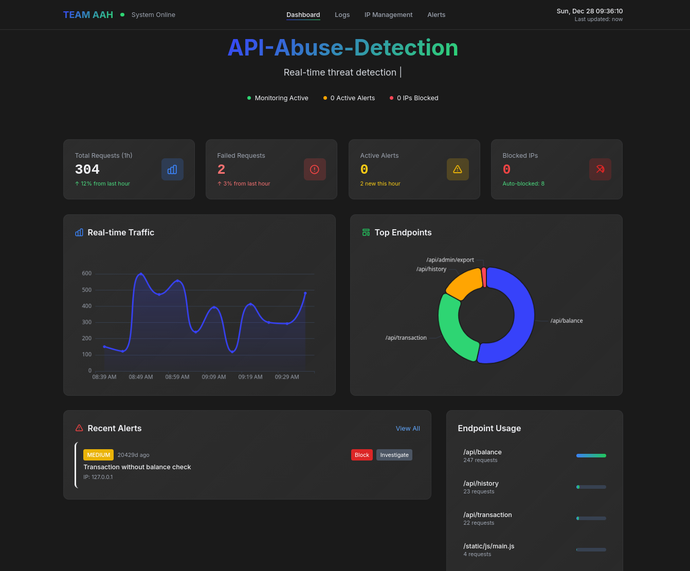
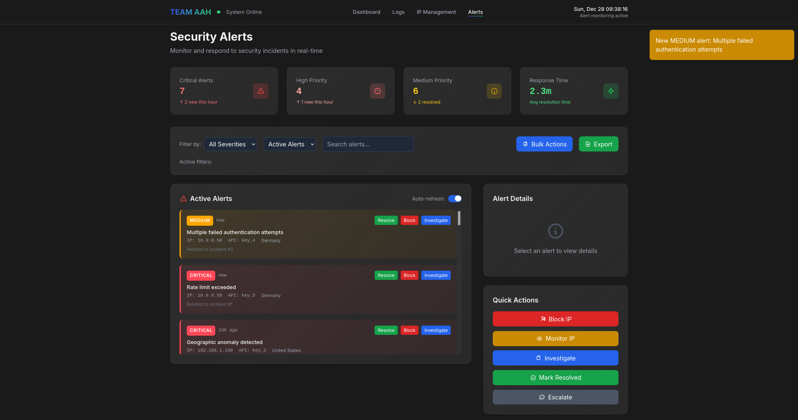
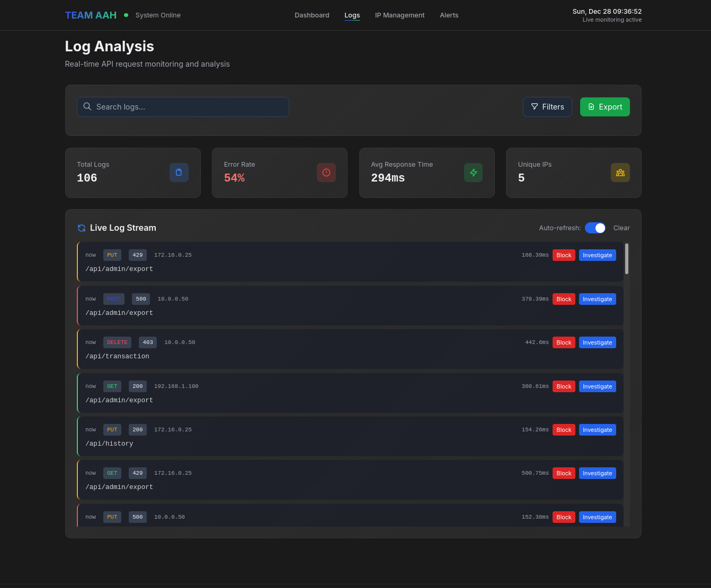
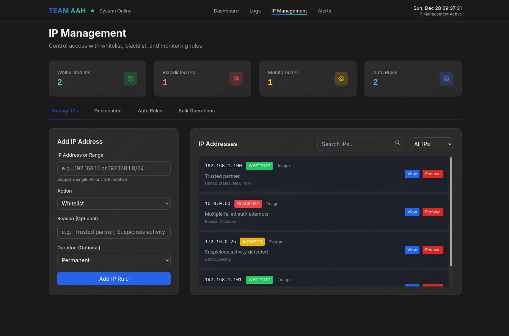

# Sentinel Protocol — API Abuse Detection



Real-time threat detection and automated response for FinTech APIs. Monitors every request, scores threats on the fly, and blocks bad actors before they cause damage.

Built for **Finnovate Hackathon (Track 6)** by **Team AAH**.

---

## Why this exists

FinTech APIs are constantly under attack — rate abuse, credential stuffing, endpoint scanning, bot traffic with rotating user-agents. Most monitoring tools catch this stuff after the fact. We built something that catches it live, scores it, and responds automatically.

---

## What it does

**Detection Engine** (runs every 15 seconds in a background thread):
- Rate abuse — flags IPs doing >100 req/min
- Burst detection — catches >50 requests in 30 seconds
- Failed auth tracking — >5 failures in 10 min triggers a block
- Transaction anomalies — payment attempts without checking balance first
- Endpoint scanning — IPs probing >5 distinct paths in under a minute
- User-agent rotation — single IP cycling through >5 different UAs
- Honeypot — instant CRITICAL alert if anyone touches `/api/admin/*`

**Threat Scoring** (0-100 score per IP):
- Aggregates alert severity, request volume, and failure rate
- Score >= 50 → auto-block 24h
- Score >= 30 → auto-block 1h
- Score >= 15 → throttle 5min
- Score < 15 → alert only

**Live Dashboard**:
- Server-Sent Events (SSE) push — no polling delay, alerts show up instantly
- Threat level indicator (SAFE/LOW/MEDIUM/HIGH/CRITICAL) with animated transitions
- Live activity feed with slide-in animations
- Toast notifications with sound for critical/high severity
- Traffic timeline and endpoint distribution charts (ECharts)
- Trend indicators comparing current hour vs previous hour
- Connection status indicator (green = live, red = reconnecting)

**Alert Management**:
- Severity-based filtering (CRITICAL/HIGH/MEDIUM/LOW)
- Correlated incident grouping — links related alerts from the same IP
- Real IP statistics in alert details (actual request counts, not mock data)
- One-click resolve + automatic unblock
- CSV export

**Log Viewer**:
- Filters out internal monitoring traffic automatically
- Filter by IP, method, status code, time range
- Auto-refreshes via SSE on new activity
- Full request details in modal view

**IP Management**:
- Whitelist/blacklist with configurable duration
- Bulk operations
- Auto-rules engine

---

## Architecture

```
                    ┌──────────────────┐
                    │  Mock FinTech    │
                    │  APIs (/api/*)   │
                    └────────┬─────────┘
                             │
                    ┌────────▼─────────┐
                    │  Middleware       │
                    │  - Rate limiter  │
                    │  - Block check   │
                    │  - Request logger│
                    └────────┬─────────┘
                             │
              ┌──────────────▼──────────────┐
              │        SQLite (logs,        │
              │     alerts, blocked_clients)│
              └──────────────┬──────────────┘
                             │
              ┌──────────────▼──────────────┐
              │    Detection Engine          │
              │    (background thread, 15s)  │
              │                             │
              │  7 detection rules          │
              │  + threat scoring           │
              │  + auto-response tiers      │
              └──────────────┬──────────────┘
                             │
              ┌──────────────▼──────────────┐
              │    SSE Stream (/stream)     │
              │    pushes alerts & blocks   │
              │    to all connected clients │
              └──────────────┬──────────────┘
                             │
              ┌──────────────▼──────────────┐
              │    Dashboard / Alerts /     │
              │    Logs / IP Management     │
              │    (Tailwind + ECharts +    │
              │     Anime.js)              │
              └─────────────────────────────┘
```

Redis is used for rate limiting if available — falls back to in-memory if not. No extra setup needed.

---

## Getting started

```bash
git clone https://github.com/x4r5h/API-Abuse-Detection.git
cd API-Abuse-Detection
pip install flask flask-cors redis
python app.py
```

Open `http://localhost:5000` — that's it.

Redis is optional. If it's running on localhost:6379, the app will use it automatically for rate limiting. Otherwise it uses an in-memory fallback.

---

## Running the attack simulator

Open `APIabuser.html` directly in your browser (it's a standalone file). It hits the running server at localhost:5000.

Available scenarios:
- **Combined Attack** — runs all attack types simultaneously (best for demos)
- **Rate Limit Attack** — single IP floods 150 requests
- **Distributed DDoS** — all simulated IPs flood at once
- **Brute Force** — multiple IPs with invalid API keys
- **Honeypot Trigger** — pokes `/api/admin/export`
- **Endpoint Scanner** — rapidly probes 12+ API paths
- **UA Rotation** — single IP with 10 different user-agents
- **Normal Traffic** — legitimate human-like behavior (for baseline comparison)

Each attack uses `X-Simulated-IP` headers so you can test from a single machine. The simulator shows live stats (total requests, blocked count, success rate, req/sec) and an activity log.

---

## Detection rules

| Threat | Trigger | Response |
|--------|---------|----------|
| Rate abuse | >100 req/min | Block 5min, HIGH alert |
| Request burst | >50 req in 30s | CRITICAL alert |
| Failed auth | >5 failures in 10min | Block 30min, HIGH alert |
| Transaction anomaly | Payment without balance check | MEDIUM alert |
| Endpoint scanning | >5 distinct paths in 1min | HIGH alert |
| UA rotation | >5 user-agents in 10min | HIGH alert |
| Honeypot | Any `/api/admin/*` access | Instant CRITICAL + block |

On top of these, the threat scoring system aggregates everything into a 0-100 score and applies tiered auto-responses.

---

## API endpoints

**Mock FinTech APIs** (these get monitored):
```
GET  /api/balance
POST /api/transaction
GET  /api/history
```

**Monitoring APIs**:
```
GET  /api/monitoring/stats
GET  /api/monitoring/stats-comparison
GET  /api/monitoring/timeline
GET  /api/monitoring/alerts
GET  /api/monitoring/blocked
GET  /api/monitoring/logs
GET  /api/monitoring/ip-stats/<ip>
GET  /api/monitoring/threat-scores
GET  /api/monitoring/correlated-incidents
GET  /api/monitoring/stream              (SSE)
POST /api/monitoring/block-ip
POST /api/monitoring/unblock
POST /api/monitoring/alert/<id>/resolve
```

---

## Project structure

```
API-Abuse-Detection/
├── app.py                  # Backend — detection engine, threat scoring, SSE, all APIs
├── templates/
│   ├── index.html          # Dashboard with live feed + threat level
│   ├── alerts.html         # Alert management + correlated incidents
│   ├── logs.html           # Log viewer with filters
│   └── ip-management.html  # IP whitelist/blacklist
├── static/
│   ├── js/
│   │   ├── main.js         # Dashboard — SSE, charts, toast notifications
│   │   ├── alerts.js       # Alert filtering, real IP stats, SSE
│   │   ├── logs.js         # Log analysis, SSE auto-refresh
│   │   └── ip-management.js
│   └── resources/
│       ├── hero-bg.jpg
│       └── world-map.jpg
├── scripts/
│   ├── test_attack_traffic.py
│   ├── test_normal_traffic.py
│   └── run_full_test.py
├── APIabuser.html          # Browser-based attack simulator
├── preview/                # Screenshots for README
└── README.md
```

---

## Tech stack

| | |
|---|---|
| **Backend** | Python, Flask, SQLite |
| **Real-time** | Server-Sent Events (SSE) |
| **Rate limiting** | Redis (optional, in-memory fallback) |
| **Frontend** | Tailwind CSS, Vanilla JS |
| **Charts** | ECharts |
| **Animations** | Anime.js, Typed.js |

---

## Screenshots

| Dashboard | Alerts |
|-----------|--------|
|  |  |

| Logs | IP Management |
|------|---------------|
|  |  |

---

## Team

Built by **Team AAH** for Finnovate Hackathon (Track 6)
